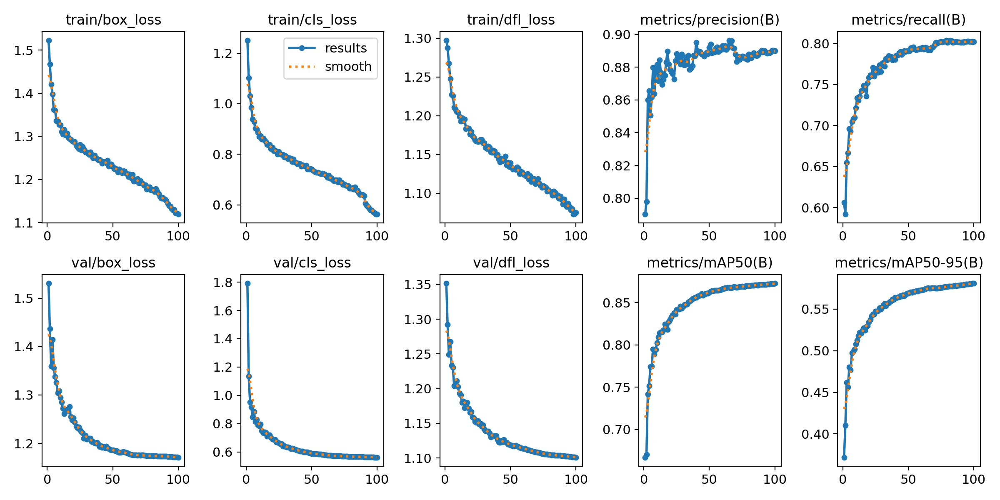
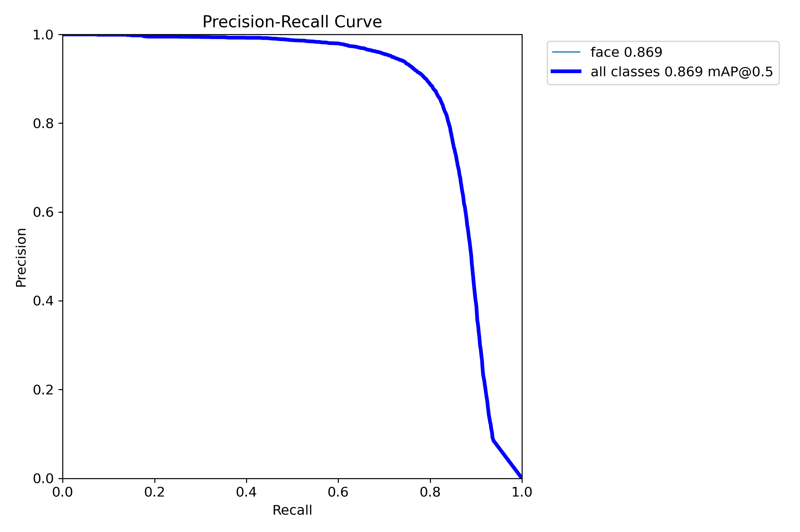
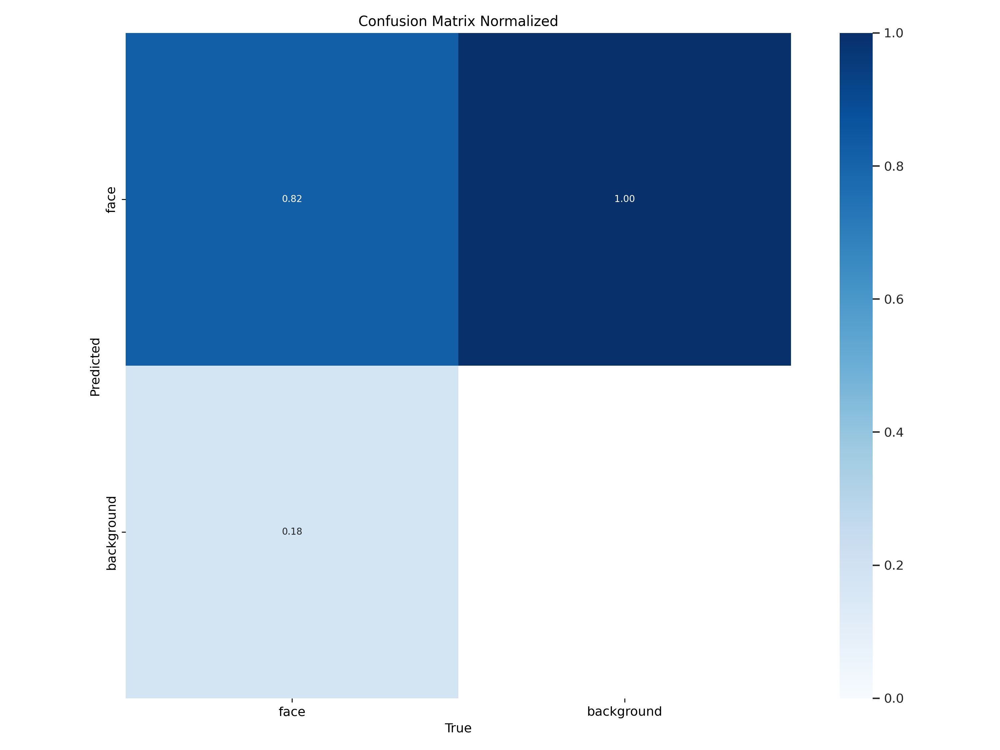
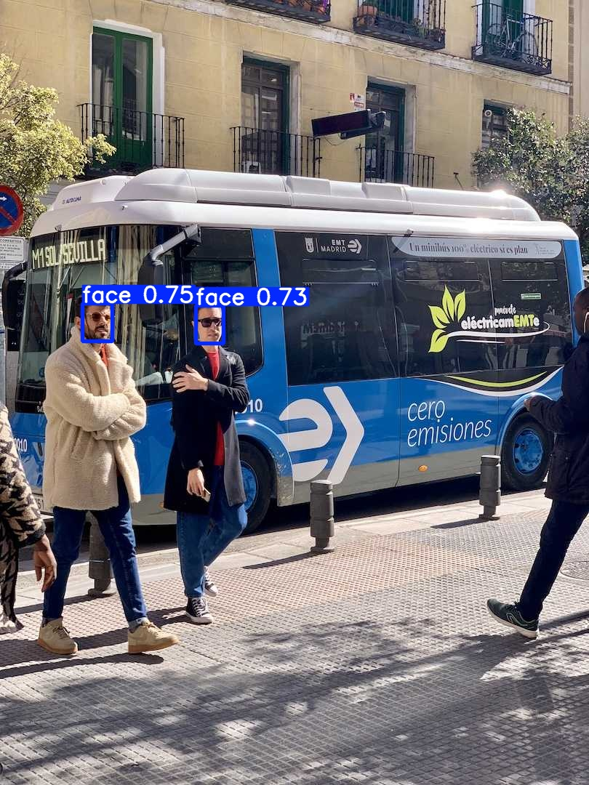

# FaceDetection
Face detection with yolo v11 using pytorch

### Introduction

YOLO v11 모델을 얼굴 데이터셋에 fine tuning 하여 얼굴 인식을 수행하고자 했습니다.
학습 데이터셋은
[Face-Detection-Dataset](https://www.kaggle.com/datasets/fareselmenshawii/face-detection-dataset)
을 사용했습니다.

### Requirements
After cloning the repo, run this line below:
```
pip install -r requirements.txt
```

### Usage
```
# wandb setting
wandb login <API key>
yolo settings wandb=True

# train
python -m FaceDetection.model

# inference
python -m FaceDetection.inference
```

### Statistics

##### 1. train summary

|  class  | Images | Instances | Box(P) | Box(R) | Box(mAP50) | Box(mAP50-95) | 
|---------|--------|-----------|--------|--------|------------|---------------|
|  All    | 3347   | 10299     | 0.891  | 0.798  | 0.869      | 0.578         |

- optimizer: Adam(lr=0.01, momentum=0.937)
- total epochs: 100
- params: 2.5M
- GFLOPs: 6.3


##### 2. plots






##### 3. inference result



